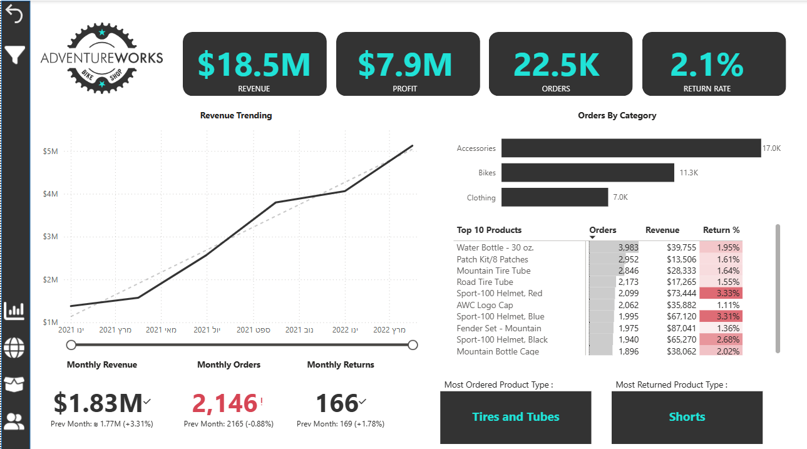

#  Power BI Project – AdventureWorks Sales Analysis

### 📊 Overview
This project focuses on analyzing sales, product, and customer data of **AdventureWorks**, a retail company in the bicycle and accessories industry.  
The main objective was to transform raw operational data into **meaningful business insights** through data modeling, DAX calculations, and interactive dashboards.

---
### 📸 Dashboard Preview

---

## 🎯 Project Objectives
- Import and transform data using **Power Query Editor**
- Build a structured relational **data model** with key relationships and hierarchies  
- Create business **KPIs** using **DAX**  
- Analyze sales and profit **trends over time** (monthly and yearly)  
- Design clear, **interactive dashboards** to support data-driven decisions  

---

## 🧱 Data Preparation & Modeling
- Handled **missing and inconsistent values**  
- Converted data types and standardized categories  
- Created **calculated columns and measures** using DAX  
- Built a **relational data model** including:
  - Fact tables: *Sales*, *Returns*  
  - Dimension tables: *Products*, *Customers*, *Date*, *Categories*  
  - One-to-many relationships  
  - Time and product hierarchies for advanced analysis  

---

## 🔍 Key Business Questions
- How do **revenue**, **profit**, and **orders** evolve over time?  
- Which product categories and products generate the highest revenue?  
- What is the **return rate**, and which products are most affected?  
- Who are the **most valuable customers**?  
- How does **revenue per customer** change over time?  
- How well does the business perform **against monthly targets**?  

---

## 📈 Reports & Visualizations
- **Executive Dashboard** – High-level KPIs, revenue trends, category performance, top products, and return analysis.  
- **Product Detail Report** – Product-level performance, target comparison, return rates, and *What-if parameter* simulations.  
- **Customer Detail Report** – Customer segmentation, revenue per customer, top customers, and demographic analysis.  

The dashboards use a wide variety of visuals including:
📊 KPI cards, line charts, bar charts, tables, slicers, drill-throughs, and tooltips.

---

## 💼 Business Value
The dashboard provides a **comprehensive view of business performance**, identifies key trends and inefficiencies,  
and enables management to make **informed, data-driven decisions** regarding products, customers, and overall profitability.

---

### 🛠 Tools & Technologies
- **Power BI** – DAX, data modeling, KPI design, and report building  
- **Power Query Editor** – Data transformation and cleaning  
- **Excel / CSV** – Data source and integration layer  

---

⭐ **Author:** Paz Oz  
🎓 *B.A. in Economics & Business Administration*  
📧 [pazoz2102@gmail.com](mailto:pazoz2102@gmail.com) 
